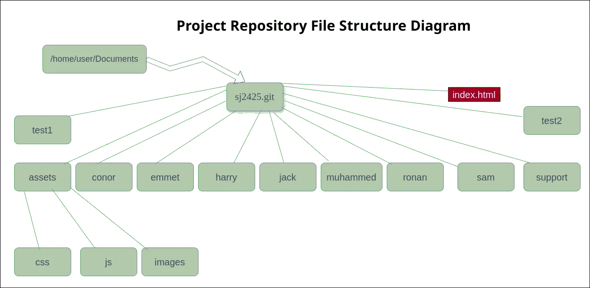

====================
Website Source Codes
====================

All our works---including our public website source codes---are hosted in the Github repository. 

Downloading the website source codes
------------------------------------

To download the website source codes on your laptop, please run the following commands:

.. code-block:: console

    :~$ cd 
    :~$ cd Documents
    :~$ git clone git@github.com:sjscompclub/sj2425.git sj2425.git
  
.. note:: 

    The above commands download the website codes from the **GitHub** repository in
    your **Documents** folder.  On completion,  you should have a new
    folder---named **www.git**, inside your **Documents** folder---with all the files. 
    
Opening the Source Code folder on VS Code
-----------------------------------------

Run the following commands to open the website source code folder on Visual Studio Code (VS Code):

.. code-block:: console

    :~$ cd 
    :~$ cd Documents/sj2425.git
    :~$ code .

.. Attention::

    By the way, I hope you haven’t forgotten that:

    * all above statements (commands) have to be executed in the terminal; and 
    * each statement ends with pressing the <ENTER> key on your keyboard.

Review of some basic Unix Commands
~~~~~~~~~~~~~~~~~~~~~~~~~~~~~~~~~~

In this section, to better understand the file structure of our source code, we will use/review the following Unix commands:

* The **ls** command (*list command*) :  We use this command to list/display a folder's content (files and folders).
* The **cd** or **chdir** command  (*change directory command*) : We use this command to change our working/present directory.  In other words, we use this command to move around our file/folder structure.
* The **pwd** command (*print working, or present, directory command*): We use this command to display the current folder's path (or name).

Please run the following commands:

.. code-block:: bash

    :~$ cd
    # This statement should bring you to the root of your home directory
    :~$ pwd
    /home/user
    # /home/user is your root of your home directory
    :~$ ls
    Desktop  Documents  Downloads  Music  Pictures  Public  snap  Templates  Videos
    # This lists the content of your home directory.
    :~$ cd Documents
    # It takes you to the Documents folder of your home directory
    :~$ pwd
    /home/user/Documents
    # pwd shows you are now at /home/user/Documents folder
    :~$ ls
    # Now, it lists the content of your Documents folder
    :~$ cd sj2425.git
    # Now, it takes you to sj2425.git folder of your Documents folder
    :~$ ls
    # Now, list all contents of sj2425.git folder
    :~$ cd assets
    # Now, it takes you to the assets folder of sj2425.git 
    :~$ cd css
    # Now, it takes you to the css folder of assets folder.
    :~$ pwd
    /home/user/Documents/sj2425.git/assets/css
    # Now, it shows the location where you are.
    :~$ cd ../
    # Now, it takes you back to assets folder (parent of css folder)
    :~$ cd css
    # Now, go back again to css folder of assets folder.
    :~$ cd ../js
    # It takes back to assets and then to js folder of assets.

Project Repository Structure
----------------------------

Once downloaded on your laptop, your source code folder structure should be similar to the following diagram:

The *index.html* file
~~~~~~~~~~~~~~~~~~~~~

Index.html is the most common file name that most websites serve if a requesting user has not specified the file name. 

The *assets* folder
~~~~~~~~~~~~~~~~~~~

We will store the website's styling (CSS) files, animation (JavaScript) files, and images in this folder.

Each student will have their own  CSS and JavaScript files that they may store in the subfolders of this folder.

The *conor* folder
~~~~~~~~~~~~~~~~~~

Conor will store his HTML and other files and folders in this folder.

The *emmet* folder
~~~~~~~~~~~~~~~~~~

Emmet will store his HTML and other files and folders in this folder.

The *harry* folder 
~~~~~~~~~~~~~~~~~~

Harry will store his HTML and other files and folders in this folder.

The *jack* folder
~~~~~~~~~~~~~~~~~

Jack will store his HTML and other files and folders in this folder.

The *muhammed* folder 
~~~~~~~~~~~~~~~~~~~~~

Muhammed will store his HTML and other files and folders in this folder.

The *ronan* folder
~~~~~~~~~~~~~~~~~~

Ronan will store his HTML and other files and folders in this folder.

The *sam* folder
~~~~~~~~~~~~~~~~

Sam will store his HTML and other files and folders in this folder.

The *support* folder
~~~~~~~~~~~~~~~~~~~~

This folder holds all supporting documents, including this page file, to help students for the project.

The *test1* and *test2* folders
~~~~~~~~~~~~~~~~~~~~~~~~~~~~~~~

We will test our work in one of these folders.

    
Summary
-------

With the website source codes fully downloaded on your laptop and your
understanding of the structure, you are now ready to start coding.

.. warning::

    By now, you should have realised that each of you has an assigned directory
    where you save your files and folders. 

    Please ensure that you save your work only in your assigned directory.

Happy coding!
